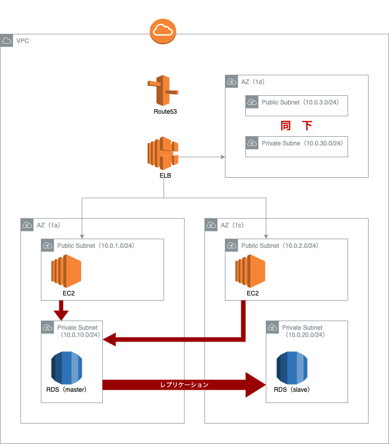

# TerraformでVPC, EC2, RDSを構築

動くところまで記述

## 前提・準備
- AWSのデフォルトプロファイルを設定してある

## 1. SSHに必要な鍵を生成
```sh:
$ ssh-keygen -t rsa -f ~/.ssh/tf_aws_key -N ''
```

## 2. Terraform実行
```sh:
$ terraform apply
```

## 3. 接続確認
```sh:
# EC2
$ ssh -i ~/.ssh/tf_aws_key ec2-user@[表示されたIPアドレス]
# RDS
$ mysql -h [エンドポイント] -u [ユーザー名] -p
```

## イメージ図(現在)

